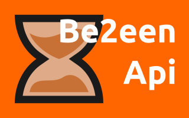

Welcome to the BeTween Api documentation!
=========================================

.. _minetest: https://www.minetest.net/

This is a library written in lua for the game `minetest`_ that implements tools for creating timers and animations as objects that can be configurated with properties and events.

Contents
--------

Everything of BeTween Api is defined inside the namespace `Be2eenApi <./api.html>`_ .

.. toctree::

	commands
	api
	examples
