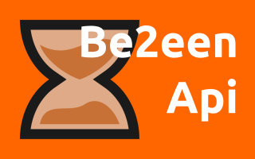
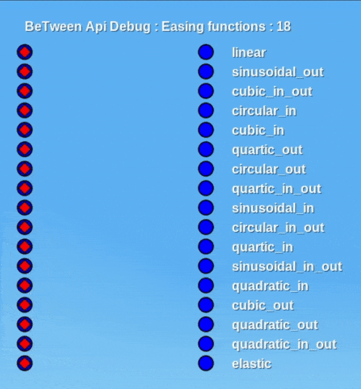

<p align=center>
	
</p>

[](https://content.minetest.net/packages/_gianpy_/api_between/)


# Be2een Api

> timers, animation and action! *ciack*

This is a library written in lua for the game [minetest](https://www.minetest.net/) that implements tools for creating timers and animations as objects that can be configurated with properties and events.

The animation system is flessible, is possible to define custom functions to change ui elements or world behaviour.

## Usage

The library acts like a mod, just add it in your mod list and enable it in your world. by itself it does nothing, because it implements features for other mods.

Add the dependency in your mod and use the namespace to access the api functionality, see the wiki for a detailed list of all functions.

## Wiki

Currenlty no wiki or documentatio page exists, however the code has comments using the [sumnkeno annotation](https://github.com/LuaLS/lua-language-server) so you can still have info about methods.

## Contribute

Yeah, you can ask for a specific feature in [issue](https://github.com/GianptDev/minetest-be2een-api/issues) or you can implement it and make a [pull request](https://github.com/GianptDev/minetest-be2een-api/pulls).

## Quick examples

Here some examples of code to use the api.

* Call a function after time elapse:

```lua
-- call function after 3.0 seconds.
Be2eenApi.after(3.0, function (timer)
	minetest.chat_send_all("Hello everybody!");
end);
```

* Animate value from start to end and call function for each frame with the animated value:

```lua
-- animate value from 10 to 30 in 2.0 seconds and call function each global step with value.
Be2eenApi.animate(10, 30, 2.0, function (tween, value)
	minetest.chat_send_all(("Animation step: %.2f"):format(value));
end);
```

* Create a timer that after finishing it will enable loop and change his callback function:

```lua
-- create the timer object
local timer = Be2eenApi.Timer();

timer.onStart = function (timer)
	minetest.chat_send_all(
		("See you after %.2f seconds..."):format(timer:get_time_left()));
end

-- set function to trigger when finished
timer.onFinish = function(timer)
	minetest.chat_send_all("I just finished ! But now I will start again..");

	-- you can change the timer events...
	timer.onFinish = function (timer)
		minetest.chat_send_all("..and again");
	end

	-- ...and properties anywhere!
	timer.loop = true;
	timer:reset(1.0);
end

-- start the timer for the given amount of seconds
timer:play(3.0);
```

* when a player joins it will, after 1 second, create an animated label that moves on the screen:

```lua
local players = {};

minetest.register_on_joinplayer(function (player)

	-- wait 1 second before creating the animation
	Be2eenApi.after(1.0, function ()

		-- make sure the player is still online
		if not minetest.get_player_by_name(player:get_player_name()) then return; end

		-- make animation object
		local tween = Be2eenApi.Tween();
		tween.loop = true; -- make the animation loop
		tween.pingpong = true; -- make the animation reverse
		tween.intepolation = Be2eenApi.Interpolations.elastic; -- not using boring linear animation.
		tween.duration = 4.0;

		-- create label to animate
		local id = player:hud_add({
			hud_elem_type = "text",
			offset = { x = 32, y = 120 },
			text = "Tween"
		});

		-- update animation each step
		function tween:onStep ()
			player:hud_change(id, "offset", {

				-- the property we are animating.
				x = self:get_animated(32, 300),
			
			y = player:hud_get(id).offset.y });
		end

		-- make sure to remove label
		function tween:onStopped ()
			player:hud_remove(id);
		end

		-- add animation object to list,
		-- it will be used to stop the animation when the player leave.
		players[player:get_player_name()] = tween:start();
	end);

end);

minetest.register_on_leaveplayer(function (player)
	local plr = player:get_player_name();

	-- just to be 100% sure
	if players[plr] then
		players[plr]:stop();
		players[plr] = nil;
	end
end);
```

* This is an animation that show an ui animated with the api using all his interpolations functions:

<p align=center>
	
</p>

* Here also a video I made time ago of an hud animated with an older version of this api: [youtube](https://www.youtube.com/watch?v=FzuNvx5aFR8)
